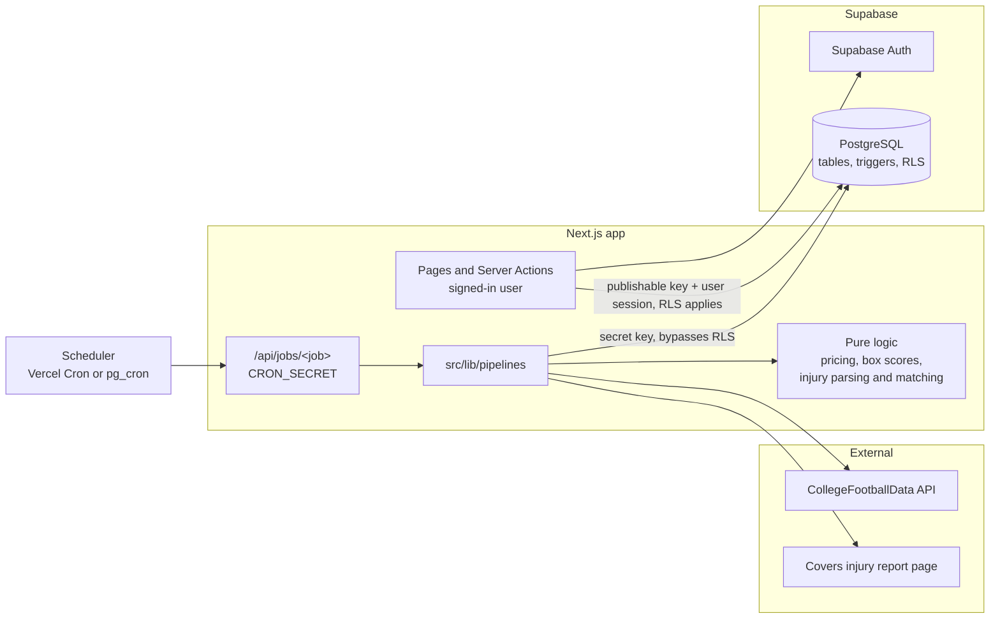
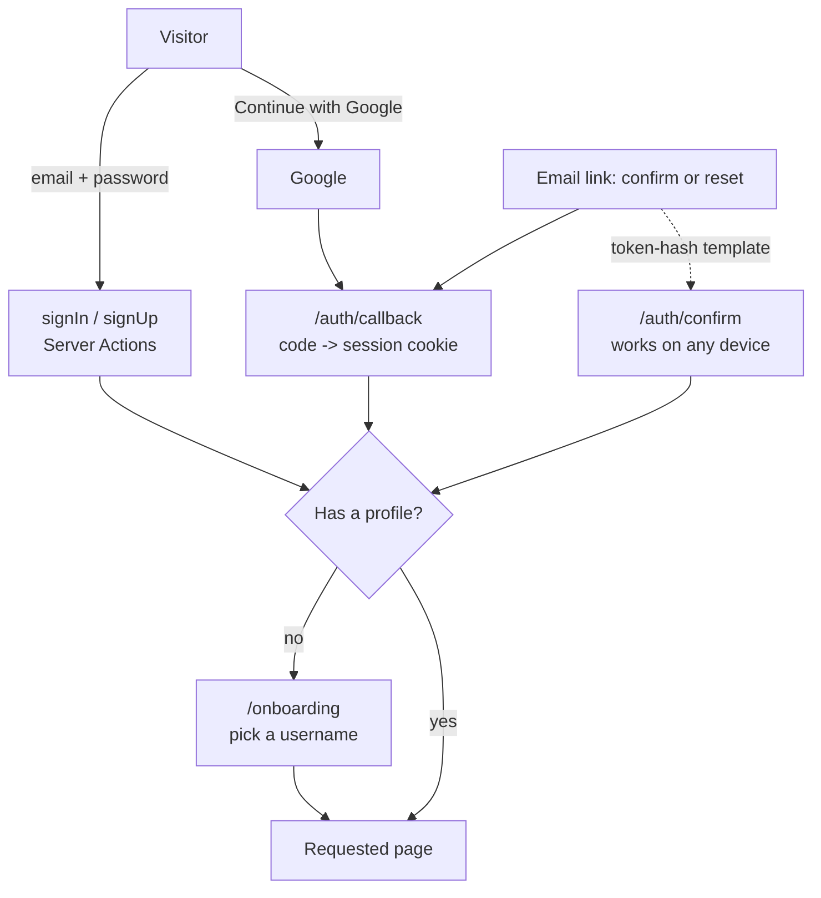
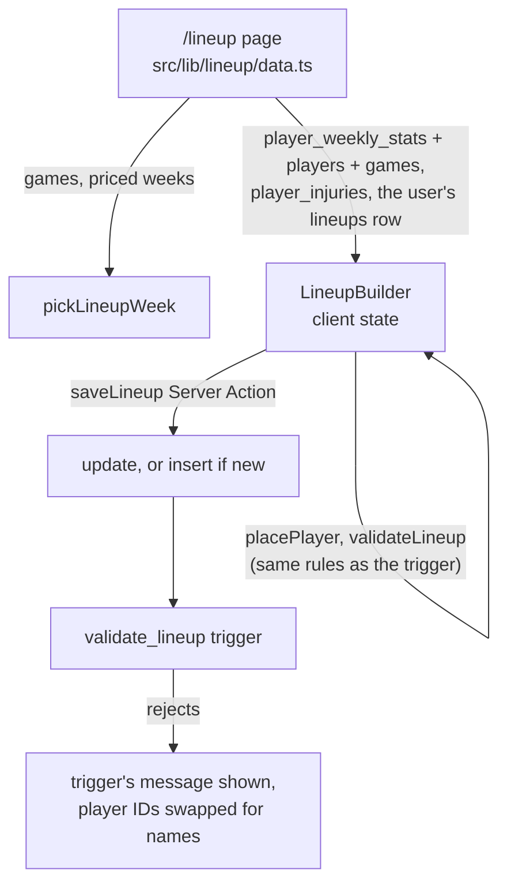
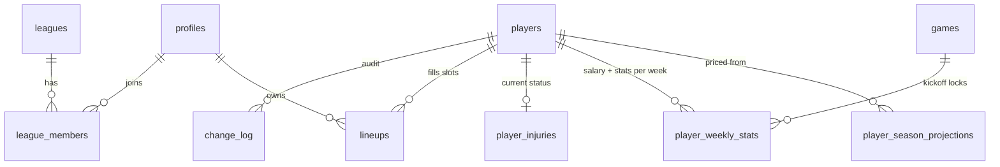
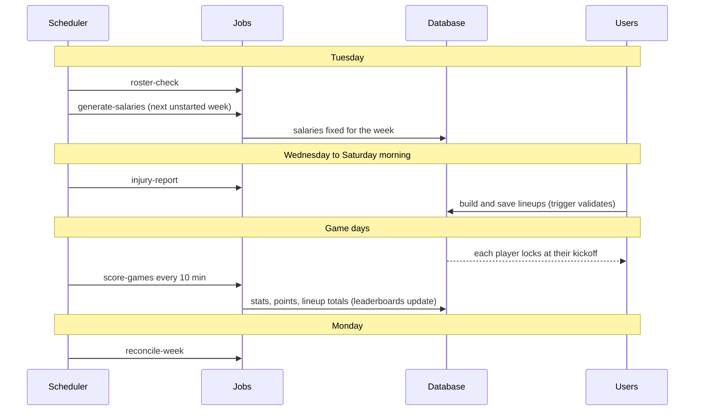

# Architecture

How SEC Gridiron 100 fits together: what runs where, where data comes from,
and how it moves through the system. The product rules are in
[PRD.md](PRD.md); this document covers how they're built.

Last updated: 2026-09-30, after Phase 5 (leagues and leaderboards).

## Build status

| Phase (PRD Section 5) | Status |
| --- | --- |
| 1. Foundation and database | Done |
| 2. CFBD API and data pipelines | Done, run against the real Supabase project (2026 season loaded, Weeks 5 and 6 priced) |
| Injury feed (added after Phase 2) | Done; table filled from Covers |
| Pre-Phase 3 setup | Done: `main` branch, job schedules, hosted on Vercel at <https://sec-fantasy-game.vercel.app> |
| 3. Authentication and navigation | Done: email/password sign-in, password reset, username onboarding, app shell. The Google button is built and works once Google is set up ([SETUP.md](SETUP.md) step 4) |
| 4. Lineup builder | Done: `/lineup` shows the week's pool, per-player locks, budget and client checks that mirror the trigger; saves through a Server Action |
| 5. Leagues and leaderboards | Done: global leaderboard, create/join/leave/delete leagues, league standings, global rank on the profile |
| 6. Admin screen | Not started |
| 7. Polish and deployment (live scoring schedule) | Not started |

## System overview

There are two ways into the database, and they're kept apart on purpose:

- **Users** (browser, Server Components, Server Actions) use the publishable
  key and their own session. Row Level Security decides what they can read
  and write, and database triggers enforce the game rules. The app can't
  bypass either.
- **Scheduled jobs** use the secret key (`src/lib/supabase/admin.ts`), which
  bypasses RLS. Only the job route imports it.

## Sign-in and accounts

Supabase Auth handles accounts, passwords and Google sign-in; the session
lives in cookies set by `@supabase/ssr`.

- **Every account has a profile.** A signed-in user without a `profiles`
  row (a new sign-up, by email or Google) is sent to `/onboarding` before any
  player page. Usernames are 3–20 letters, numbers or underscores, unique
  regardless of case (enforced by the database too).
- **Two layers of access checks.** The proxy makes a quick, cookie-only
  check and sends signed-out visitors on protected pages to
  `/login?next=...`. Each protected page then checks properly on the server
  through `src/lib/auth/dal.ts` (`requireUser`, `requireProfile`), which
  verifies the session token. The database's RLS is the final word on data.
- **After sign-in, sign-out or onboarding** the actions call
  `revalidatePath("/", "layout")` so the header re-renders with the new state.
- **Redirects stay on this site.** `next` values are checked by
  `safeNextPath`, so a crafted link can't bounce users elsewhere.
- **Password reset:** `/forgot-password` emails a link that signs the user
  in through `/auth/callback`, then `/reset-password` sets the new password.
  The form gives the same answer whether or not an account exists.
- **Admins:** `profiles.is_admin`; the header shows an Admin link and
  `/admin` returns 404 to everyone else.

## Lineup builder

`/lineup` is a Server Component that loads the week (as the signed-in user,
so RLS applies) and hands it to one Client Component, `LineupBuilder`, which
keeps the draft in React state (`useReducer`) until the user saves.

- **Which week:** the earliest priced week with a game still to kick off.
  Once a week's last game kicks off it stays on show, read-only, until the
  next week is priced (Tuesday 12:00 UTC); the page says when that is.
  Before any week is priced the page says when the next one opens.
- **Locks:** each player locks at their own game's kickoff. The builder
  works this out from the kickoff time and re-checks every 30 seconds, so a
  page left open locks players on time; a slot whose saved player has kicked
  off can't be changed or emptied.
- **Client checks** (`src/lib/lineup/rules.ts`, unit tested) mirror the
  trigger: cap of 100, positions, no duplicates, player in the pool and
  active, no changes to locked slots. They only guide the user; the trigger
  decides.
- **Saving:** `saveLineup` re-checks sign-in, validates the request's shape,
  then updates the user's row for that week, or inserts it if there isn't
  one. It doesn't upsert, because users may update only the slot columns.
  A trigger refusal (`P0001`) comes back as the trigger's own message.
- **The player list** is filtered and sorted in the browser
  (`src/lib/lineup/pool.ts`): position (including FLEX), team, search,
  maximum salary, sort by salary, Blended PPG, value, kickoff or name, and a
  switch (on by default) to hide players with 0 Blended PPG.
- **Times** are shown in US Eastern, the same on server and browser. Games
  stored at midnight Eastern are shown as "time TBA" (CFBD's placeholder).
- **Phones:** one column, with the budget and Save button in a bar along the
  bottom; tapping an empty slot jumps to the list filtered to that position.

## Leagues and leaderboards

Both boards come from one database function, `leaderboard(season, week,
league_id)`, which returns each user's week score, season total and both
ranks (ties share a rank). It runs with the caller's rights: scores come from
`public_lineups`, which everyone may read, and league members are visible
only to other members, so a non-member gets an empty board.

- **Global board** (`/leaderboard`): everyone with a lineup this season,
  top 100, plus the user's own row if they're further down. Season or week
  view, and a picker for any week that has been played.
- **Weeks shown**: priced weeks with a game that has kicked off. Before the
  first one, the page says when it starts.
- **Leagues** (`/leagues`): create (the database picks the 6-character
  code), join by code, or open a share link (`/leagues?join=CODE`) that
  fills in the code. A league page shows the invite code, standings for
  every member (0 for weeks without a lineup), and rename/delete for the
  creator or leave for everyone else. The creator can't leave: a trigger
  stops it, since nobody else could manage the league.
- **Refreshing**: while a game of the shown week is in progress (kicked off
  in the last 5 hours, not final), the page reloads its data every minute.
  Scores only change when a scoring job runs; until `score-games` is
  scheduled (Phase 7) that's Monday's `reconcile-week`.
- **Profile**: global rank is the user's season rank.

## Code layout

| Path | Role |
| --- | --- |
| `src/app` | Pages, layouts and the `/api/jobs/[job]` route |
| `src/app/(auth)` | Sign-in pages: `/login`, `/signup`, `/forgot-password`, `/reset-password` |
| `src/app/(app)` | Pages for signed-in players with a username: `/lineup`, `/leaderboard`, `/leagues`, `/profile`, `/admin` |
| `src/app/auth` | Sign-in Server Actions and the email/Google landing routes (`/auth/callback`, `/auth/confirm`) |
| `src/app/onboarding` | Username picker every new user goes through once |
| `src/components/shell` | Header, desktop navigation, mobile menu, user dropdown |
| `src/components/lineup` | Lineup builder: slots, budget bar, player list |
| `src/components/leaderboard`, `src/components/leagues` | Standings table, week/season switch, auto-refresh, league forms |
| `src/lib/leaderboard`, `src/lib/leagues` | Board weeks and live check, form checks (pure, unit tested) and their data loaders |
| `src/lib/lineup` | Lineup rules, week picker, pool filters, time formats (pure, unit tested) and the page's data loader |
| `src/lib/auth` | Who's signed in (`dal.ts`), which pages need sign-in (`routes.ts`), form checks (`validation.ts`) |
| `src/proxy.ts`, `src/lib/supabase/proxy.ts` | Refresh the user's session cookie on every request, and send signed-out visitors on protected pages to sign in |
| `src/lib/supabase` | Clients: `client.ts` (browser), `server.ts` (server, as the user), `admin.ts` (secret key, jobs only) |
| `src/lib/cfbd` | CFBD client; each method is one API call |
| `src/lib/pricing` | Pricing engine: Blended PPG, starter share, value over fringe, salary limits |
| `src/lib/scoring` | Box score parsing into stat lines |
| `src/lib/injuries` | Covers page parser, name matcher, safety check |
| `src/lib/pipelines` | The jobs: thin database code around the pure functions |
| `supabase/migrations` | Schema, triggers, RLS; the source of truth for the database |
| `supabase/tests` | SQL tests, run against a throwaway Postgres by `npm run test:db` |

Pipelines follow one pattern: load rows, call pure functions (unit tested),
write rows. Anything worth testing lives in a pure function.

## Data sources

| Source | Used for | Cost / limits |
| --- | --- | --- |
| CFBD `/games` | SEC schedule and kickoff times, finished games | Free plan: about 1,000 calls a month |
| CFBD `/roster`, `/recruiting/players` | Player pool, recruiting stars | 16 + 4 calls |
| CFBD `/games/players` | Box scores (stats, fumbles lost, pass attempts, carries) | 1 call per week of games |
| Covers `ncaaf/injuries` page | Injury statuses (display only) | 1 request per run, about 1.3 MB of HTML |

We checked ESPN's college injury feed (stale, dated 2020) and CBS's college
injury page (renders no data) and don't use them. Covers lists players as
first initial and last name, so injuries are matched by team, initial and
last name, with position breaking ties.

## Database

Migrations are applied in order; new changes get a new migration, and
applied ones are never edited.

| Migration | Adds |
| --- | --- |
| `20260929000000_initial_schema` | `profiles`, `players`, `games`, `player_season_projections`, `player_weekly_stats`, `lineups`, `leagues`, `league_members`, `change_log`; lineup validation, locking, scoring refresh, `public_lineups` view, league functions, RLS |
| `20260930000000_data_pipelines` | `app_settings` (tunable pricing and season settings), `player_game_stats` (every game's stat lines), `ppr_points()` |
| `20261001000000_starter_share` | Pass attempts and carries on stat lines, `starter_share` on weekly rows, starter share settings |
| `20261002000000_player_injuries` | `player_injuries` (status, injury, note, source, date, admin override) |
| `20261003000000_pricing_fringe` | `fringe_rank_offset` pricing setting (0 = last starter, 1 = first backup) |
| `20261004000000_leaderboards` | `leaderboard()` ranking function; trigger stopping a league's creator from leaving it |

`player_game_stats` has no foreign keys on purpose: it holds last season's
lines and non-conference games, which aren't all in `players` or `games`.

### Rules the database enforces

- **Lineups** (`validate_lineup()` trigger): no duplicate players, positions
  fit their slots, every player is active and priced that week, total salary
  of 100 or less, and no changes to a slot whose player has kicked off.
- **Locking** (`is_player_locked()`): worked out from `games.kickoff_at` at
  save time, so it never depends on a job running on time.
- **Points**: `fantasy_points` is a generated column, so points always match
  the stat line.
- **Hidden picks**: other users' lineups are read through `public_lineups`,
  which shows a slot only once that player has kicked off.
- **Admin writes**: players, projections, salary overrides, settings and
  injuries are writable from the app only by admins (`is_admin()`). An admin
  edit to an injury must set `admin_override`, so the job keeps it.

## Pipelines

Each job is `/api/jobs/<job>` (GET for the scheduler, POST by hand) with
`Authorization: Bearer <CRON_SECRET>`, or `runJob()` called directly with the
admin client. Schedules live in `vercel.json` and run on the production
deployment; Vercel sends the `CRON_SECRET` header itself. Every automated change goes to `change_log` with
`changed_by = NULL`.

| Job | Schedule | CFBD calls | Reads | Writes |
| --- | --- | --- | --- | --- |
| `preseason-setup` | Once per season | ~39 | CFBD games, rosters, recruits, box scores | games, players, player_game_stats, projections |
| `roster-check` | Tuesday 10:00 UTC | 17 | CFBD games, rosters | games (kickoff times), players, change_log |
| `generate-salaries` | Tuesday 12:00 UTC, after roster-check | 0 | players, projections, stat lines, settings | player_weekly_stats (salary, blended PPG, starter share), change_log |
| `score-games` | Every 10 min on game days (not scheduled yet: needs Vercel Pro or pg_cron) | 1–2 per run while live | CFBD box scores, finished games | player_game_stats, player_weekly_stats, games.status, lineup totals |
| `reconcile-week` | Monday 12:00 UTC | 2 | CFBD box scores, finished games | as score-games, marks games final |
| `injury-report` | Daily 13:00 UTC; acts Wed–Fri and within 24h of an SEC kickoff | 0 (1 Covers request) | Covers page, players | player_injuries, change_log |

### Weekly cycle

### Pricing (generate-salaries)

1. **Inputs per player**: last season's PPG, the preseason projection, this
   season's PPG and games played, and starter share (their share of the
   position group's work over the team's last 3 games, relative to a full
   starter's share).
2. **Blended PPG**: this season's weight is G / (G + 3); the rest is split
   60/40 between last season and the projection, both scaled by starter share.
3. **Salary**: 5 + (Blended PPG − position fringe level) × k. The fringe
   level is the last starter at each position (QB rank 16, RB 32, WR 48,
   TE 16), and k makes the most expensive possible lineup cost 145. Both are
   measured over every active SEC player, not just the week's pool, so a
   player's price only moves when their own numbers do. Rounded, kept
   between 5 and 30, and moved at most 4 from the previous week.
4. Admin overrides are kept, and the job refuses once any of the week's
   games has kicked off.

All the numbers above live in `app_settings.pricing`, so they can be tuned
without code changes.

### Injuries (injury-report)

1. Fetch and parse the Covers page (one section per FBS team).
2. Match SEC QB/RB/WR/TE entries to active players (team + initial + last
   name, position as tie-breaker, then last name + position as a fallback).
3. **Safety check** before writing anything. It refuses the page if there are
   fewer than 100 teams, a team's rows don't match its printed count, the
   page lists nobody, most statuses aren't recognised, fewer than 12 SEC
   teams appear, or the report would cut stored injuries by more than 60%.
   A refusal is logged as `injury_report_skipped` and the old data stays.
4. Upsert matched rows (skipping admin overrides), then clear players no
   longer listed, only for teams that were on the page.
5. Log unmatched names as `injury_unmatched`, once per name per season.

Injury status is display only; pricing never reads it.

## Configuration

Production: <https://sec-fantasy-game.vercel.app> (Vercel, deploys `main`).

| Variable | Where it's used |
| --- | --- |
| `NEXT_PUBLIC_SUPABASE_URL` | All clients. Just `https://<ref>.supabase.co`, no path |
| `NEXT_PUBLIC_SUPABASE_PUBLISHABLE_KEY` | Browser and server clients (safe to expose) |
| `SUPABASE_SECRET_KEY` | `admin.ts` only (jobs) |
| `CFBD_API_KEY` | CFBD client |
| `CRON_SECRET` | Job route authorization; Vercel Cron sends it automatically |

## Decisions

| Date | Decision | Why |
| --- | --- | --- |
| Phase 1 | Game rules enforced by database triggers and RLS, not just the app | The rules hold even if the client is bypassed |
| Phase 1 | Per-player locking computed from kickoff times | No dependency on a job running at the right moment |
| Phase 2 | Pure functions for pricing, parsing and week picking; thin DB code | Testable without a database or network |
| Phase 2 | Settings in `app_settings` | Pricing can be tuned from the admin screen |
| 2026-09-29 | Starter share scales last season and the projection | Backups were priced like starters |
| 2026-09-29 | Injuries from Covers; display only | Only one of the three sources had current data |
| 2026-09-29 | Injury writes guarded by a safety check | A broken page read must never wipe good data |
| 2026-09-29 | Host on Vercel; schedule the daily-or-less jobs now, live scoring later | Keeps stats and prices current before launch on the free plan |
| 2026-09-30 | Supabase Auth with Server Actions; username picked in onboarding, not at sign-up | One flow for email and Google users; Google accounts have no username to start with |
| 2026-09-30 | Access checked in the proxy (fast, cookie only) and again on each page (verified) | The proxy runs on every request and can't be the only guard |
| 2026-09-30 | Pricing fringe = last starter, measured over all SEC teams | Starting QBs had become too pricey; prices moved when different teams were in the pool even with no new games |
| 2026-09-30 | Lineup draft kept in React state (`useReducer`), not Zustand | One component owns it; no extra dependency |
| 2026-09-30 | Builder shows the earliest priced week with a game to come; a finished week stays read-only until the next is priced | Users always see the lineup that matters now |
| 2026-09-30 | Lineup save is update-then-insert, not upsert | Users may update only slot columns; the trigger's messages reach the user unchanged |
| 2026-09-30 | Leaderboards ranked in the database by one function, with the caller's rights | One definition for both boards; RLS keeps league boards private |
| 2026-09-30 | A league's creator can't leave it, only delete it | Otherwise nobody could rename or delete the league |

## Open items

- **Pricing**: tuned on 2026-09-30 (see Decisions). Worth another look once
  a few weeks of real lineups show whether QBs are now too cheap. About 420
  of ~500 pool players cost the 5-credit minimum; nearly all are backups who
  haven't played; the lineup builder hides players with 0 Blended PPG by
  default.
- **"Time TBA" kickoffs**: CFBD stores games without a set time at midnight
  Eastern, so those players lock at that midnight until the Tuesday roster
  check brings in the real time. Early, never late, but worth knowing.
- **Injury "healthy" status**: an admin can't yet mark a listed player as
  healthy for good (a removed row comes back while Covers still lists them).
- **Covers terms of use**: review before relying on the page in production.
- **Live scoring schedule**: `score-games` every 10 minutes needs Vercel Pro
  or Supabase pg_cron (Phase 7). Until then Monday's `reconcile-week` brings
  in final stats.
- **Email**: Supabase's built-in email is rate limited; custom SMTP is needed
  before launch (SETUP.md step 5).
- **Deleting an account that created a league** fails until its leagues are
  deleted (the league keeps a reference to its creator). Fine for now; an
  account deletion feature would need to handle it.

## Keeping this document current

Update this file in the same commit as any change to the architecture: a new
table or migration, a new job or data source, a change to how the app talks
to the database, or a decision worth recording. Update the build status table
when a phase finishes.
